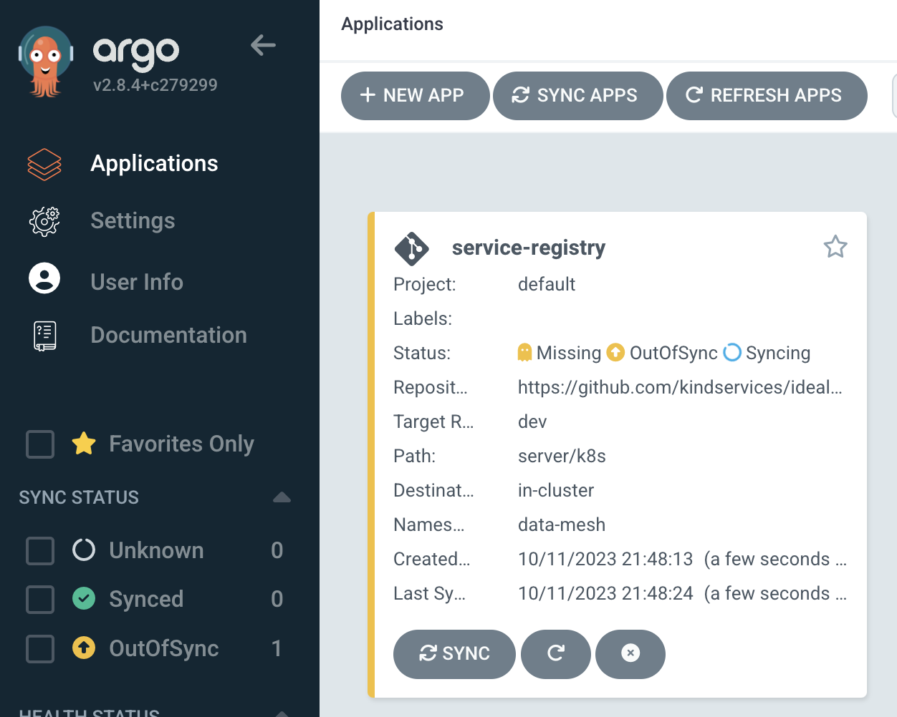
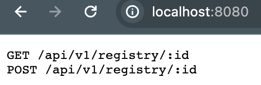
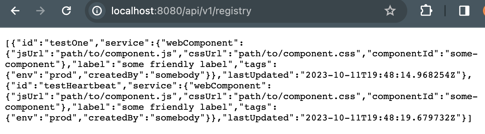
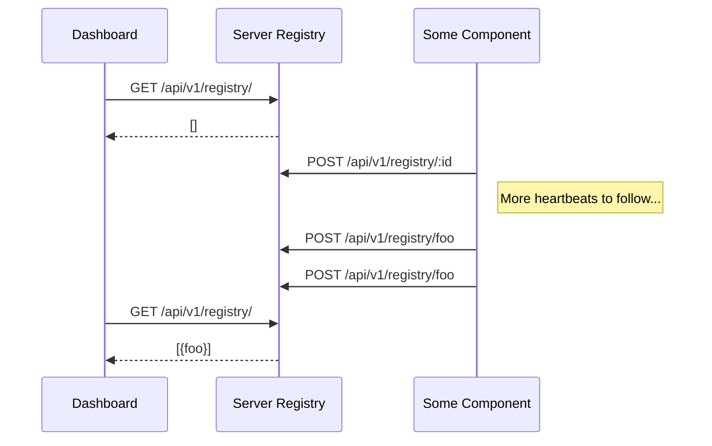

# About
A simple service registry for use in the "data mesh" idealab 

The idea is that there is a REST service which tracks registered services and their metadata.


# Installation

The server is defined as a [kubernetes service](./server/k8s/server.yaml).

We provide a convenience script for spinning it up, assuming you have [argocd installed](https://argo-cd.readthedocs.io/en/stable/).
(If not, see [our docs](https://github.com/kindservices/local-kubernetes) on testing this out/installing argocd locally)

Just run `install.sh` and you should see it installing on your cluster:


# Local Usage

### Starting the server:

```shell
cd server
make run
```



### Starting the client:

```shell
cd client
make test
```

which should send some test messages to the running server and print the heartbeat responses:
```
Response(http://localhost:8080/api/v1/registry/testHeartbeat,200,OK,{"webComponent":{"jsUrl":"path/to/component.js","cssUrl":"path/to/component.css","componentId":"some-component"},"label":"some friendly label","tags":{"env":"prod","createdBy":"somebody"}},Map(date -> List(Wed, 11 Oct 2023 19:48:15 GMT), content-length -> List(188), connection -> List(keep-alive), content-type -> List(text/plain; charset=utf-8)),None)
Response(http://localhost:8080/api/v1/registry/testHeartbeat,200,OK,{"webComponent":{"jsUrl":"path/to/component.js","cssUrl":"path/to/component.css","componentId":"some-component"},"label":"some friendly label","tags":{"env":"prod","createdBy":"somebody"}},Map(date -> List(Wed, 11 Oct 2023 19:48:17 GMT), content-length -> List(188), connection -> List(keep-alive), content-type -> List(text/plain; charset=utf-8)),None)
Response(http://localhost:8080/api/v1/registry/testHeartbeat,200,OK,{"webComponent":{"jsUrl":"path/to/component.js","cssUrl":"path/to/component.css","componentId":"some-component"},"label":"some friendly label","tags":{"env":"prod","createdBy":"somebody"}},Map(date -> List(Wed, 11 Oct 2023 19:48:19 GMT), content-length -> List(188), connection -> List(keep-alive), content-type -> List(text/plain; charset=utf-8)),None)
```

which we can then also observe on the server:




# Registry REST Service

This has been done in rapid development, rather than contract-first.


## Endpoints
### Health Endpoint
```
GET /health
```

### List Registered Components
```
GET /api/v1/registry/
```

### Get a registered component
```
GET /api/v1/registry/:id
```

### Register a component
```
POST /api/v1/registry/:id
```
with the body being a register request


## Data Model

### Register Request
```
{ 
  webComponent: { jsUrl, cssUrl, componentId },
  label,
  tags: {
    foo : bar
  }
}
```

# Design

This service registry could work in its own right, but it was created to support a 
the micro front-end design for the [Kind Serivces data mesh idea lab](https://www.kindservices.co.uk/idealab)



